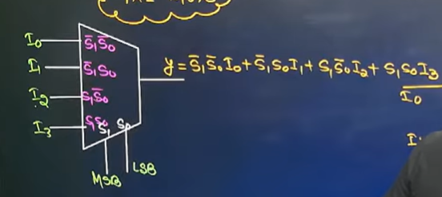
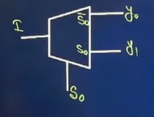

*MUX, De-MUX, Adder, Subtructor**
===
---

# **MUX:**

## **Question Type 1:**
> - **Designing a higher order MUX by using lower Order MUX**
> - if making 4x1 MUX using 2x1 MUX, total number of 2x1 MUX need = 4/2 +2/1 = 2+1 = 3
> - if making 8x1 MUX using 2x1 MUX, total number of 2x1 MUX need = 8/2 + 4/2 +2/1 = 4+2+1 = 7

## **Question Type 2:**
> - **Number of 2x1 MUX:**
> - For AND, OR, NOT => One 2x1 MUX
> - For NAND, NOR, XOR, XNOR => Two 2x1 MUX

## **Question Type 3:**
> - **Minimization:**

## **Question Type 4:**
> - **Cascading of Mux**
> - Note: If a MUX has all inputs as high then output must be high.
> - Note: If a MUX has all inputs as low then output must be low.

## **Question Type 5:**
> - **Implementation of function**
> - Using 8x1, 4x1, 2x1 MUX 

## **Question Type 6:**
> - **Delay**

---
# **De-MUX:**

> - y0 = S'I, y1 = SI
> - Same process to calculate total number of lower De-MUX need to build higher De-MUX.

---

# **Half Adder/ two bits adder:**
> - for implement a half-adder or half-subtructor, we need to use 5 NOR or 5 NAND gates.

# **Full Adder/ three bits adder:**
> - for implement a full-adder or full-subtructor, we need to use 9 NOR or 9 NAND gates.

