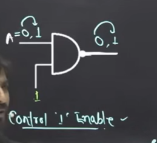
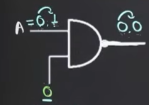
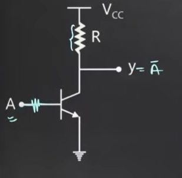

# 🔲 NOT Gate (Inverter)

> [!NOTE]
> The **NOT Gate (Inverter)** is the simplest logic gate. It produces the complement of its input.
>
> **Truth Table:** `0 → 1` &nbsp;&nbsp; `1 → 0`

---

# ⏱️ Propagation Delay (Tpd)

> [!IMPORTANT]
> **Propagation Delay (Tpd)** is the time taken for the output to change after the input changes.

```
Input  ────┐      ┌────────
           │      │
───────────┘──────┘────────

Output ───────┐      ┌─────
              │      │
──────────────┘──────┘─────
            ← Tpd →
```

---

# 🔁 Buffer

> [!TIP]
> Connecting **two NOT gates in series** forms a **Buffer**.

```
Input ──► NOT ──► NOT ──► Output

Output = Input
```

### Purpose

- Signal restoration
- Improve driving capability
- Reduce loading effects

---

# 🔄 Astable Multivibrator

> [!NOTE]
> An **Astable Multivibrator** continuously oscillates between **HIGH (1)** and **LOW (0)** without any external trigger.

### Characteristics

- ❌ No stable state
- 🔄 Continuous oscillation
- ⏰ Generates clock pulses
- 📈 Produces a square wave

### Applications

- Clock Generator
- Pulse Generator
- LED Flasher
- Timer Circuits

---

# 💾 Bistable Multivibrator (Basic Memory Element)

> [!IMPORTANT]
> The **Bistable Multivibrator** is the opposite of the Astable Multivibrator.

### Characteristics

- ✅ Two stable states
- ❌ Does not oscillate automatically
- 🎯 Changes state only when triggered
- 💾 Stores one bit of information

> Also known as a **Flip-Flop**.

---

# 🔗 Odd Number of NOT Gates in a Loop

> [!WARNING]
> An **odd number of NOT gates connected in a feedback loop** forms a **Ring Oscillator** (Astable Multivibrator).

### Formula

**Time Period**

```
T = 2N * Tpd
```

Where

- `N` = Number of NOT Gates
- `Tpd` = Propagation Delay

**Frequency**

```
F = 1/T
```

or

```
F = 1 / (2N * Tpd)
```

---

# ⏳ Common SI Prefixes

| Prefix | Symbol | Value |
|---------|:------:|-------:|
| milli | m | 10⁻³ |
| micro | µ | 10⁻⁶ |
| nano | n | 10⁻⁹ |
| pico | p | 10⁻¹² |
| femto | f | 10⁻¹⁵ |

### Larger Units

| Prefix | Symbol | Value |
|---------|:------:|-------:|
| kilo | k | 10³ |
| mega | M | 10⁶ |
| giga | G | 10⁹ |
| tera | T | 10¹² |
| peta | P | 10¹⁵ |
| exa | E | 10¹⁸ |
| zetta | Z | 10²¹ |

---

# 💡 Memory Formula

```text
1 Byte = 8 bits
```

---

# 🎛️ Control Using AND Gate

## ✅ Control = 1 (Enable)

> [!TIP]
> When the control input is **1**, the AND gate passes the input directly to the output.

```
A • 1 = A
```



---

## ❌ Control = 0 (Disable)

> [!WARNING]
> When the control input is **0**, the AND gate blocks the input.

```
A • 0 = 0
```



---

# 🖼️ NOT Gate Circuit



---
